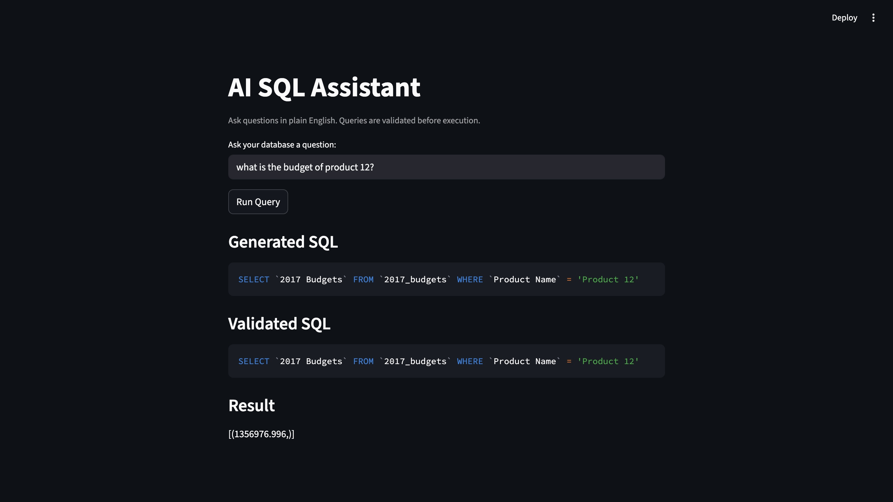

# AI-Powered SQL Query Assistant

A production-style **natural language to SQL system** powered by **Google Gemini**, **LangChain**, and **Streamlit**, with a **query validation layer** that prevents unsafe or invalid SQL from ever reaching the database.

This project demonstrates how modern LLMs can be safely integrated into real data systems by combining schema awareness, validation logic, and a clean UI.

---

## Preview

> Streamlit Interface



> System Architecture


---

## Overview

This application allows users to ask questions in **plain English** and receive **validated SQL queries** that are safely executed against a **MySQL database**.

Instead of trusting the LLM blindly, the system introduces a **backend validation layer** that:

* Blocks destructive queries
* Verifies table and column references
* Enforces `SELECT-only` execution
* Prevents schema hallucination

This makes the system suitable for **analytics use cases**, **internal dashboards**, and **secure data exploration tools**.

---

## Problem Statement

LLMs are powerful at generating SQL, but in real systems they can:

* Hallucinate table or column names
* Generate unsafe queries like `DROP`, `DELETE`, or `UPDATE`
* Break production databases
* Return misleading or invalid results

Most demos stop at “SQL generation.” This project focuses on the **hard part**: **making AI-generated SQL safe, reliable, and production-ready.**

---

## Solution

The system introduces a **multi-layer execution pipeline**:

1. User asks a question in natural language
2. LLM generates SQL using live schema context
3. Backend validates the SQL
4. Only approved queries reach the database
5. Results are rendered in a structured UI

This ensures **trust, safety, and correctness** instead of blind execution.

---

## Execution Flow

```
User
  ↓
Streamlit UI (app.py)
  ↓
Backend Layer
  - Schema Injection
  - SQL Generation (Gemini)
  - Query Validation
  ↓
MySQL Database
  ↓
Results Rendered as Table
```

---

## Technology Stack

* **Frontend**: Streamlit
* **LLM**: Google Gemini (via LangChain)
* **Backend**: Python
* **Database**: MySQL
* **Validation Engine**: Regex + Schema Mapping
* **Security**: Environment-based API keys

---

## High-Level Architecture

```
User / Browser
     ↓
Streamlit UI (app.py)
     ↓
Backend Layer
  ├── Schema Reader
  ├── Gemini SQL Generator
  ├── SQL Validator
     ↓
MySQL Database
     ↓
Validated Results Display
```

---

## Project Structure

```
AI-Powered-SQL-Query-Assistant/
├── app.py                 # Streamlit UI + Execution Pipeline
├── python_backend.py    # Production backend (validated SQL flow)
├── raw_backend.py       # Raw LLM SQL generation (no validation)
├── assets/              # Architecture & UI screenshots
│   ├── Architecture_diagram.png
│   └── ai_sql_assistant.jpg
├── .gitignore
└── README.md
```

---

## Components Explained

### 1. Streamlit UI (`app.py`)

This is the user-facing layer.

Responsibilities:

* Accepts natural language questions
* Displays generated SQL
* Shows validated SQL
* Renders query results as tables
* Displays validation errors cleanly

Key Features:

* Live feedback loop
* SQL transparency (users can see what gets executed)
* Table-based result rendering

---

### 2. Production Backend (`python_backend.py`)

This is the **core intelligence layer**.

Responsibilities:

* Injects database schema into LLM prompt
* Generates SQL using Gemini
* Normalizes SQL syntax
* Enforces safety rules
* Validates table and column references

Validation Rules:

* Only `SELECT` queries allowed
* Blocks `DROP`, `DELETE`, `UPDATE`, `INSERT`, `ALTER`, `TRUNCATE`
* Verifies columns exist in schema
* Verifies table exists in schema

This is what turns the project from a demo into a **safe data system**.

---

### 3. Raw Backend (`raw_backend.py`)

This file shows the **baseline system** without validation.

Purpose:

* Demonstrates the risk of executing LLM-generated SQL directly
* Serves as a comparison layer for learning.

This is useful for explaining:

> “Here’s what breaks without a validation layer.”

---

## Security Design

### API Key Protection

The Gemini API key is **never stored in code**.

It is loaded using an environment variable:

```bash
export GEMINI_API_KEY="your_api_key_here"
```

The app reads it securely:

```python
google_api_key=os.getenv("GEMINI_API_KEY")
```

This prevents:

* Accidental leaks in GitHub
* Hardcoded secrets in source files

---

## Validation Logic (How Safety Works)

### Step 1: Normalize SQL

* Removes backticks
* Converts to lowercase
* Cleans spacing

### Step 2: Safety Check

Blocks queries containing:

```
DROP, DELETE, UPDATE, INSERT, ALTER, TRUNCATE, CREATE, REPLACE
```

### Step 3: Schema Verification

* Extracts table name from SQL
* Confirms table exists in database
* Extracts selected columns
* Confirms each column exists in that table

Only if all checks pass:

> The query is executed.

---

## Example Query Flow

**User Input:**

> What was the budget of Product 12?

**Generated SQL:**

```sql
SELECT `2017 budgets` FROM `2017_budgets` WHERE `product name` = 'Product 12'
```

**Validation Result:**

* Table exists
* Column exists
* Safe SELECT query

**Execution:**

Results are displayed in a formatted table in the UI.

---

## Why This Project Stands Out

Most AI-SQL projects stop at:

> Prompt → SQL → Execute

This project implements:

> Prompt → SQL → **Validate → Enforce → Execute → Display**

This reflects how **real enterprise AI systems** are designed.

It demonstrates:

* LLM control systems
* AI safety engineering
* Backend validation pipelines
* Secure deployment patterns

---

## Future Improvements

### RAGAS Evaluation Layer

Planned:

* Measure SQL accuracy
* Track hallucination rate
* Score semantic relevance
* Evaluate execution correctness

---

## Key Learnings

* Safe LLM integration patterns
* Schema-aware prompt engineering
* SQL validation pipelines
* Secure API key handling
* Production-style system design
* AI reliability engineering

---

## Author

**Sai Nandan MN**
AI | Data | Cloud Engineering

---

> This project was built to demonstrate how AI systems can move beyond demos and into **secure, production-grade data tools.**

